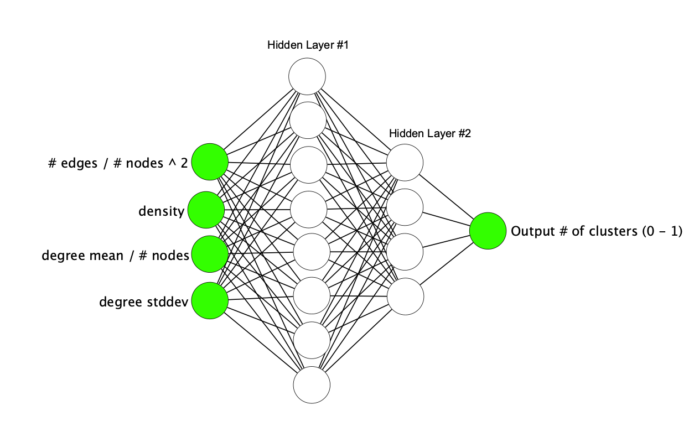

UD-985
======

.. _CDAPS: https://github.com/idekerlab/cy-community-detection
.. _PyTorch: https://pytorch.org/
.. _Infomap: https://github.com/idekerlab/cdinfomap
.. _CliXO: https://github.com/idekerlab/cdclixo
.. _Louvain: https://github.com/idekerlab/cdlouvain
.. _OSLOM:  https://github.com/idekerlab/cdoslom
.. _Bioplex: http://ndexbio.org/#/network/98ba6a19-586e-11e7-8f50-0ac135e8bacf

This repository contains scripts and data needed for the experiments described
below.

EVERYTHING IN THIS REPO EXPERIMENTAL AND MAY CONTAIN ERRORS. USE AT YOUR OWN RISK.

The Problem
-----------

Currently the Community Detection App (`CDAPS`_) allows users
to run four community detection apps wrapped in containers
(`OSLOM`_, `CliXO`_, `Infomap`_, & `Louvain`_)
but the app requires the user to invest significant effort
to decide on optimal parameters to use.

The Ultimate Goal
-----------------

The ultimate goal is to empower `CDAPS`_ with features that makes it
easier for users to generate "useful" clusters/hierarchies.

A “useful” cluster/hierarchy is defined by a set of attributes
possessed in the resulting cluster/hierarchy. What those attributes
are is still up for debate.

The Intermediate Goal
---------------------

Given a set of attributes about a network try to predict
the number of clusters that a specific algorithm will
generate when run on the network.

Desired outcome
---------------

We want to gain insight as to whether a neural network can
deduce a pattern for predicting outcomes from clustering
algorithms. If neural networks are successful prediction,
then experiments with more advanced predictive neural
networks can be performed.

Experiment
----------

1. Take `Bioplex`_ and generate thousands of subnetworks in two ways

   a. By generating random sub networks ``generate_subgraph.py``

   b. By generating sub networks using GO terms ``generate_gosubgraph.py``

2. Create a neural network in `PyTorch`_ that takes a set
   of basic network attributes (# nodes, # edges, avg
   node degree etc..) and outputs a single number denoting
   number of clusters that will be generated

3. Generated training data by running `Infomap`_ on networks from step 1

4. Need to verify there is not wild variability when feeding same input to `Infomap`_ repeatedly.

5. Use 80% of data from step 3 to train the neural network

6. Run prediction on remaining 20%

7. Assess predictive power

8. If successful repeat for `CliXO`_, `Louvain`_, `OSLOM`_ …
   could also vary parameters and see if prediction holds
   for a new model trained with alternate parameters and
   whether the old models do well

.. note::

         For `Infomap`_ use some default set of parameters that tend to give good hierarchies.

Design of Neural Network
------------------------

**Description of the inputs**

* ``# edges / # nodes ^2``

  The number of edges in the graph divided by the number of nodes squared

* ``density``

  Value from this equation described by networkx:
  https://networkx.github.io/documentation/stable/reference/generated/networkx.classes.function.density.html

* ``degree mean / # nodes``

  Average of degree of all nodes divided by number of nodes in graph

* ``degree stddev``

  Standard deviation of degree of all nodes in graph

Scripts Requirements
--------------------

* ndex2 client > 3.3.1 & < 4.0.0
* pandas
* pytorch
* networkx > 2.3
* matplotlib

Scripts and what they do
------------------------

* ``create_trainingdata.py``

  Takes networks created from ``generate_subgraph.py`` or ``generate_gosubgraph.py``
  along with output from a community detection algorithm and generates training
  data usable by ``predict_clusters.py``

* ``extract_trainingdata.py``

  **NOT IMPLEMENTED** This script will take training data
  generated by ``create_trainingdata.py`` and attempt to normalize the data
  by extracting a subset of the data where the number of clusters is
  evenly distributed

* ``generate_subgraph.py``

  Creates networks from an input CX network
  by randomly picking nodes or selecting nodes matching genes for GO terms

* ``plot_trainindata.py``

  Creates plots from training data generated by ``create_trainingdata.py``

* ``predict_clusters.py``

  Runs training and prediction
